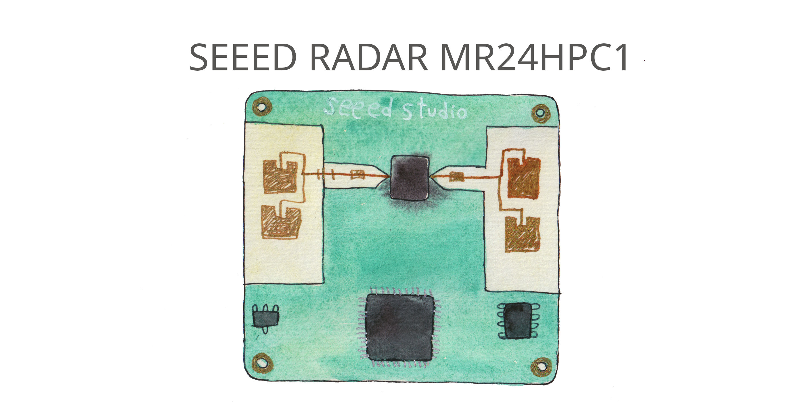

# Arduino library for Seeed MR24HPC1 24GHz radar

Arduino Library for [Seeed 24GHz mmWave Human Static Presence Lite MR24HPC1 radar sensor](https://www.seeedstudio.com/24GHz-mmWave-Sensor-Human-Static-Presence-Module-Lite-p-5524.html)



It has two modes: simple and advanced.

In order not to block incoming radar data it's recommended not to use delays. Use millis() instead.

Functions that only work in simple or advanced mode:

Functions            |SIMPLE|ADVANDCED
---------------------|------|---------
reset()              |  +   |   +
get_mode()           |  +   |   +
get_heartbeat()      |  +   |   +
get_activity()       |  +   |
get_direction()      |  +   |
get_motion()         |  +   |
get_presence()       |  +   |
get_motion_energy()  |      |   +
get_motion_speed()   |      |   +
get_motion_distance()|      |   +
get_static_energy()  |      |   +
get_static_distance()               |      | +
get_initialization_status()            | + |
get_time_for_entering_no_person_state()| + | +
get_motion_trigger_time()              |   | +
get_motion_to_static_time              |   | +
get_static_trigger_limit()             |   | +
set_static_limit()                     |   | +
set_motion_limit()                     |   | +
set_static_threshold                   |   | +
set_motion_threshold                   |   | +
set_absence_trigger_time               |   | +

## Libary Methods

### Initialice radar

```c++
Radar_MR24HPC1 radar = Radar_MR24HPC1(&Serial1);
```

### set_mode()

Set radar to simple mode:

```c++
radar.set_mode(SIMPLE);
```

Set radar to advanced mode:

```c++
radar.set_mode(ADVANCED);
```

### get_mode()

Returns rada mode:

- 0 == SIMPLE
- 1 == ADVANCED

```c++
if (radar.get_mode() == ADVANCED) {
  Serial.println("Advandced mode");
} else {
  Serial.println("Simple mode");
}
```

### run()

In the main loop, it should execute _radar.run()_ command.

It takes all incoming data frames from radar, extracts data and saves them to parameters. So that they are quickly available if you need them.

- NONVERBAL

In the background. Nothing will printed on the serial monitor.

```c++
void loop() {
  radar.run(NONVERBAL);
}
```

- VERBAL

In SIMPLE mode:

```c++
void setup() {
  radar.set_mode(SIMPLE);
}
void loop() {
  radar.run(VERBAL);
}
```


In ADVANCED mode:

```c++
void setup() {
  radar.set_mode(ADVANCED);
}
void loop() {
  radar.run(VERBAL);
}
```


### get_heartbeat()

Returns heartbeat counter value — changes once a minute.

```c++
Serial.print(radar.get_heartbeat());
```

### get_activity()

Works only in SIMPLE mode.

Returns activity value from 0 to 100.

```c++
Serial.println(radar.get_activity());
```

### get_direction()

Works only in SIMPLE mode.

Returns 1 (APPROACHING) when the human body moves closer.
Returns 2 (RECEDING) when the human body moves away from the radar.
Otherwise, it returns 0.

```c++
if (radar.get_direction() == APPROACHING) {
  Serial.println("Moves closer");
} else if (radar.get_direction() == RECEDING) {
  Serial.println("Moves away");
}
```

### get_motion()

Works only in SIMPLE mode.

Returns motion:

- 0 - NONE
- 1 - STATIV
- 2 - ACTIVE or MOTION

```c++
if (radar.get_motion() == MOTION) {
  Serial.println("Active");
} else if (radar.get_motion() == STATIC) {
  Serial.println("Static");
} else {
  Serial.println("None");
}
```

### get_presence()

Works only in SIMPLE mode.

Returns:

- 0 UNOCCUPIED
- 1 OCCUPIED When someone is in the room.

```c++
if (radar.get_presence() == OCCUPIED) {
  Serial.println("Occupied");
} else {
  Serial.println("Unoccupied");
}
```

### get_motion_energy()

Works only in ADVANCED mode.

Returns motion energy value from 0 to 250.

```c++
Serial.print("Motion energy: ");
Serial.println(radar.get_motion_energy());
```

### get_motion_speed()

Works only in ADVANCED mode.

Returns motion speed in m/s. Negative if the object is moving towards the radar. Positive if the object is moving away from the radar.

```c++
Serial.print("Motion speed: ");
Serial.print(radar.get_motion_speed());
Serial.println(" m/s");
```

### get_motion_distance()

Works only in ADVANCED mode.

Returns the distance of the moving body in cm. With a step 50cm.

```c++
Serial.print("Motion distance: ");
Serial.print(radar.get_motion_distance());
Serial.println(" cm");
```

### get_static_energy()

Works only in ADVANCED mode.

Returns static body energy value from 0 to 250.

```c++
Serial.print("Static body energy: ");
Serial.println(radar.get_static_energy());
```

### get_static_distance()

Works only in ADVANCED mode.

Returns the distance of the static body in cm. With a step 50cm.

```c++
Serial.print("Static distance: ");
Serial.print(radar.get_static_distance());
Serial.println(" cm");
```

### get_initialization_status()

Returns: 1 or 2

```c++
Serial.print("Initialization status: ");
Serial.println(radar.get_initialization_status());
```

### get_time_for_entering_no_person_state()

Returns time

Default value 30000 ms.

```c++
Serial.print("Time for entering no person state: ");
Serial.println(radar.get_time_for_entering_no_person_state());
```

### get_motion_trigger_time()

Return time

Default value 150 ms.

```c++
Serial.print("Motion trigger time: ");
Serial.println(radar.get_motion_trigger_time());
```

### get_motion_to_static_time()

Return time

Default value 3000 ms.

```c++
Serial.print("Motion to static time: ");
Serial.println(radar.get_motion_to_static_time());
```

### get_static_trigger_limit()

Unit cm

Default value 500 cm.

```c++
Serial.print("Static trigger distance limit: ");
Serial.print(radar.get_static_trigger_limit());
Serial.println(" cm");
```

### set_motion_limit(uint8_t limit)

Max limit to recognize human body movements.

In Simple mode:

- 0x01 is 4.0-4.5 m
- 0x02 is 3.5-4.0 m
- 0x03 is 2.5-3.0 m
- 0x04 is 3.0-3.5 m

In Advandced mode:

- 0x01 is 0.5m
- 0x02 is 1.0m
- 0x03 is 1.5m
- 0x04 is 2.0m
- 0x05 is 2.5m
- 0x06 is 3.0m
- 0x07 is 3.5m
- 0x08 is 4.0m
- 0x09 is 4.5m
- 0x0A is 5.0m

```c++
void setup() {
  radar.set_mode(ADVANCED);
  radar.set_motion_limit(RANGE_300_CM);
}
```

### set_static_limit(uint8_t limit)

In Simple mode:

- 0x01 is 4.0-4.5 m
- 0x02 is 3.5-4.0 m
- 0x03 is 2.5-3.0 m
- 0x04 is 3.0-3.5 m

In Advandced mode:

- 0x01 is 0.5m
- 0x02 is 1.0m
- 0x03 is 1.5m
- 0x04 is 2.0m
- 0x05 is 2.5m
- 0x06 is 3.0m
- 0x07 is 3.5m
- 0x08 is 4.0m
- 0x09 is 4.5m
- 0x0A is 5.0m

```c++
void setup() {
  radar.set_mode(ADVANCED);
  radar.set_static_limit(RANGE_300_CM);
}
```

### set_static_threshold(uint8_t limit)

Set static trigger energy threshold value from 0 to 250.

Default value is 33.

```c++
void setup() {
  radar.set_mode(ADVANCED);
  radar.set_static_threshold(33);
}
```

### set_motion_threshold(uint8_t limit)

Set motion trigger energy threshold value from 0 to 250.

Default value is 4.

```c++
void setup() {
  radar.set_mode(ADVANCED);
  radar.set_motion_threshold(4);
}
```

### set_absence_trigger_time(int time_ms)

Default value is 30000ms.

```c++
void setup() {
  radar.set_mode(ADVANCED);
  radar.set_absence_trigger_time(30000);
}
```
