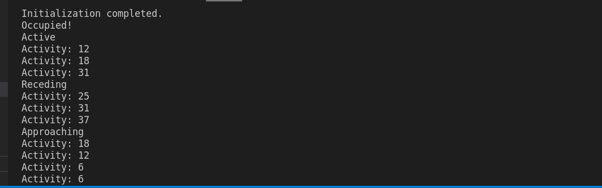
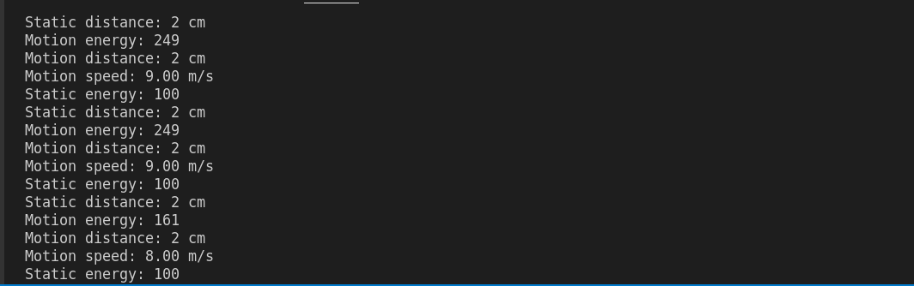

# MR24HPC1 radar library

Arduino Library for [Seeed MR24HPC1 radar](https://www.seeedstudio.com/24GHz-mmWave-Sensor-Human-Static-Presence-Module-Lite-p-5524.html)

It has two modes: simple and advanced.

In order not to block incoming radar data it's recommended not to use delays. Use millis() instead.

Functions that only work in simple or advanfced mode:

Functions            |SIMPLE|ADVANDCED
---------------------|------|---------
reset()              |  +   |   +
get_mode()           |  +   |   +
get_heartbeat()      |  +   |   +
get_activity()       |  +   |
get_direction()      |  +   |
get_motion()         |  +   |
get_presence()       |  +   |
get_motion_energy()  |      |   +
get_motion_speed()   |      |   +
get_motion_distance()|      |   +
get_static_energy()  |      |   +
get_static_distance()|      |   + 

## Initialice radar

```c++
Radar_MR24HPC1 radar = Radar_MR24HPC1(&Serial1);
```

## set_mode()

Set radar to simple mode:

```c++
radar.set_mode(SIMPLE);
```

Set radar to advandced mode:

```c++
radar.set_mode(ADVANCED);
```

## get_mode()

Returns rada mode:

- 0 == SIMPLE
- 1 == ADVANCED

```c++
if (radar.get_mode() == ADVANCED) {
  Serial.println("Advandced mode");
} else {
  Serial.println("Simple mode");
}
```

## run()

In the main loop should execute _radar.run()_ command.

It takes all incoming data frames from radar, extracts data and saves them to parameters. So that they are quickly available if you need them.

- NONVERBAL

In the background. Nothing will printed on the serial monitor.

```c++
void loop() {
  radar.run(NONVERBAL);
}
```

- VERBAL

In SIMPLE mode:

```c++
void setup() {
  radar.set_mode(SIMPLE);
}
void loop() {
  radar.run(VERBAL);
}
```



In ADVANCED mode:

```c++
void setup() {
  radar.set_mode(ADVANCED);
}
void loop() {
  radar.run(VERBAL);
}
```



## get_heartbeat()

Returns heartbeat counter value. Changes once a minute.

```c++
Serial.print(radar.get_heartbeat());
```

## get_activity()

Works only in SIMPLE mode.

Returns activity value from 0 to 250.

```c++
Serial.println(radar.get_activity());
```

## get_direction()

Works only in SIMPLE mode.

Returns 1 (APPROACHING) when human body moves closer.
Returns 2 (RECEDING) when human body moves away from radar.
Otherwise returns 0.

```c++
if (radar.get_direction() == APPROACHING) {
  Serial.println("Moves closer");
} else if (radar.get_direction() == RECEDING) {
  Serial.println("Moves away");
}
```

## get_motion()

Works only in SIMPLE mode.

Returns motion:

- 0 - NONE
- 1 - STATIV
- 2 - ACTIVE or MOTION

```c++
if (radar.get_motion() == MOTION) {
  Serial.println("Active");
} else if (radar.get_motion() == STATIC) {
  Serial.println("Static");
} else {
  Serial.println("None");
}
```

## get_presence()

Works only in SIMPLE mode.

Returns:

- 0 UNOCCUPIED
- 1 OCCUPIED When someone is in the room.

```c++
if (radar.get_presence() == OCCUPIED) {
  Serial.println("Occupied");
} else {
  Serial.println("Unoccupied");
}
```

## get_motion_energy()

Works only in ADVANDSED mode.

Returns motion energy value from 0 to 250.

```c++
Serial.print("Motion energy: ");
Serial.println(radar.get_motion_energy());
```

## get_motion_speed()

Works only in ADVANDSED mode.

Returns motion speed in m/s. Negative if the object is moving towards the radar. Positive if the object is moving away from the radar.

```c++
Serial.print("Motion speed: ");
Serial.print(radar.get_motion_speed());
Serial.println(" m/s");
```

## get_motion_distance()

Works only in ADVANDSED mode.

Returns the distance of the moving body in cm. With a step 50cm.

```c++
Serial.print("Motion distance: ");
Serial.print(radar.get_motion_distance());
Serial.println(" cm");
```

## get_static_energy()

Works only in ADVANDSED mode.

Returns static body energy value from 0 to 250.

```c++
Serial.print("Static body energy: ");
Serial.println(radar.get_static_energy());
```

## get_static_distance()

Works only in ADVANDSED mode.

Returns the distance of the static body in cm. With a step 50cm.

```c++
Serial.print("Static distance: ");
Serial.print(radar.get_static_distance());
Serial.println(" cm");
```
